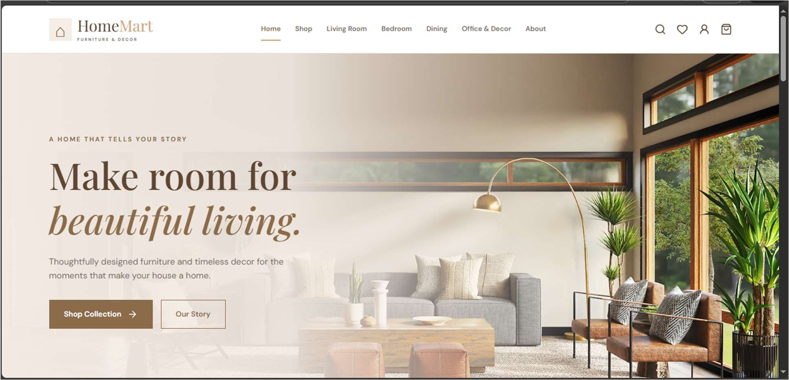
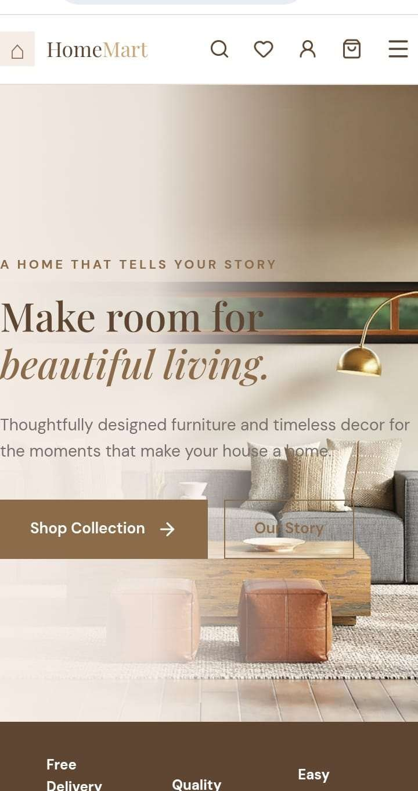
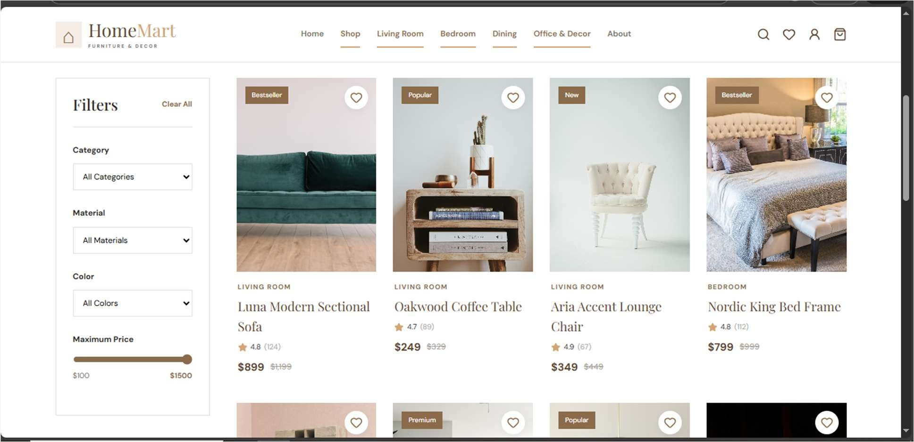
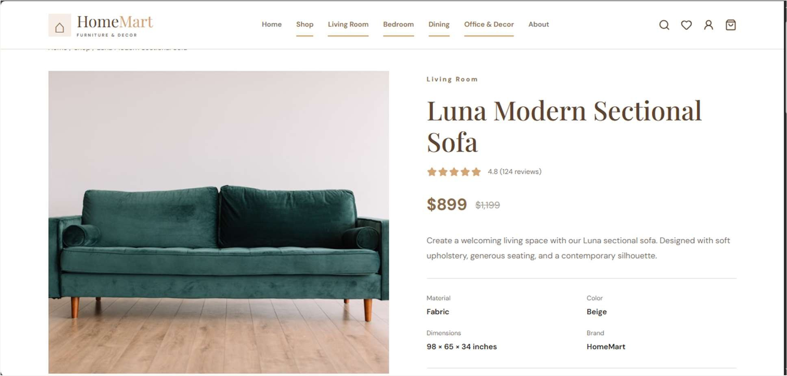
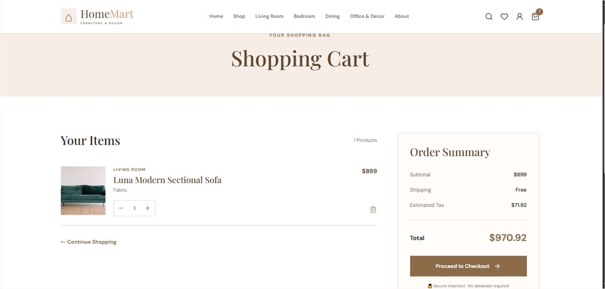
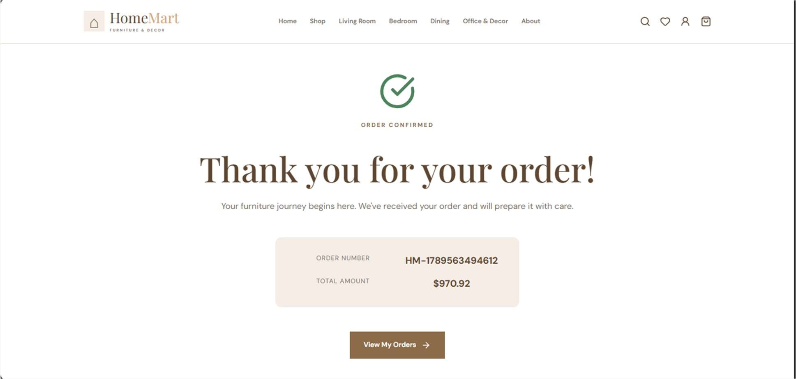
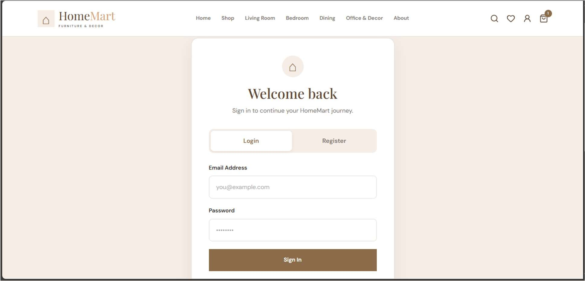

# HomeMart – Furniture & Decor

> A modern furniture and home décor e-commerce website built with React and Vite.

**Frontend Web Development Internship Project**

<p align="left">
  <a href="https://homemart-furniture.onrender.com/"></a>
  <a href="https://github.com/isakbk/homemart-furniture.git"></a>
  <a href="https://youtu.be/qPJj4V1Sh_o"></a>
</p>

## 🔗 Project Links

| Resource | Link |
|---|---|
| 🌐 Live Website | [https://homemart-furniture.onrender.com/](https://homemart-furniture.onrender.com/) |
| 💻 GitHub Repository | [https://github.com/isakbk/homemart-furniture.git](https://github.com/isakbk/homemart-furniture.git) |
| ▶️ YouTube Demo | [https://youtu.be/qPJj4V1Sh_o](https://youtu.be/qPJj4V1Sh_o) |

## 📖 About

HomeMart gives users a simple, attractive and responsive furniture shopping experience: furniture and décor browsing, product details, cart, checkout flow and account screens, using demo data (no database).

## ✨ Features

- **Responsive header** with navigation and search interface
- **Hero section** highlighting furniture and décor collections
- **Product cards** with images, names, prices and actions
- **Category browsing** – Living Room, Bedroom, Dining, Office & Decor
- **Filters** – category, material, colour and maximum price
- **Product details** with description, material, colour, dimensions and brand
- **Shopping cart** with quantity and total calculation
- **Checkout form & order summary** with order confirmation
- **Account / login screens**, empty states, alerts and loading states

## 🛠️ Tech Stack

| Technology | Purpose |
|---|---|
| React.js + Vite | Frontend framework and tooling |
| JavaScript / JSX | Language |
| CSS3 | Styling and media queries |
| Reusable components | UI structure |
| Git / GitHub | Version control |
| Render | Deployment |


## 📁 Project Structure

```
homemart-furniture/
├── public/
├── src/
│   ├── assets/
│   ├── components/
│   ├── pages/
│   ├── App.jsx
│   ├── main.jsx
│   ├── index.css
│   └── data.js
├── package.json
├── vite.config.js
└── README.md
```

## 📸 Screenshots

### Home Page – Desktop



### Home Page – Mobile



### Product Listing with Filters



### Product Details



### Shopping Cart



### Order Confirmation



### Login / Register



## 🚀 Getting Started

```bash
git clone https://github.com/isakbk/homemart-furniture.git
cd homemart-furniture
npm install
npm run dev
```

Production build:

```bash
npm run build
```

## 🎓 Learning Outcomes

- Building reusable React components
- Responsive layouts with CSS Grid/Flexbox and media queries
- Cart, checkout and account UI flows
- Deploying with GitHub and Render

## 📝 Notes

This is a **frontend-only** project built for educational and demonstration purposes. Data (products, cart, wishlist, users, orders) is simulated in the browser; a production system would need a secure backend, database and real payment integration.

## 👤 Author

**Isak B.K.** · [GitHub @isakbk](https://github.com/isakbk) · bkisak101@gmail.com
